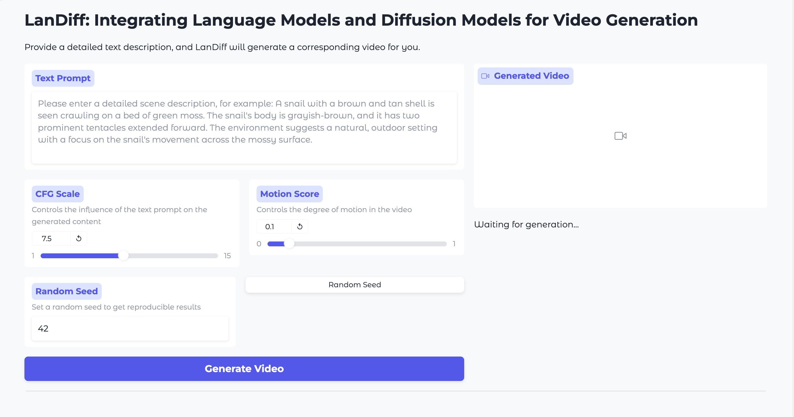

# LanDiff

<p align="center">
    💜 <a href="https://landiff.github.io/"><b>Demo</b></a> &nbsp&nbsp ｜ &nbsp&nbsp🤗 <a href="https://huggingface.co/yinaoxiong/LanDiff">Hugging Face</a>&nbsp&nbsp | &nbsp&nbsp🤖 <a href="https://www.modelscope.cn/models/yinaoxiong/LanDiff">ModelScope</a>&nbsp&nbsp | &nbsp&nbsp 📑 <a href="https://arxiv.org/abs/2503.04606">Paper</a> &nbsp&nbsp 
<br>

-----

[**The Best of Both Worlds: Integrating Language Models and Diffusion Models for Video Generation**](https://arxiv.org/abs/2503.04606)

In this repository, we present **LanDiff**, a novel text-to-video generation framework that synergizes the strengths of Language Models and Diffusion Models. **LanDiff** offers these key features:

- 👍 **High Performance**: **LanDiff** (5B) achieves a score of **85.43** on the VBench T2V benchmark, surpassing state-of-the-art open-source models like Hunyuan Video (13B) and demonstrating competitiveness with leading commercial models such as Sora, Kling, and Hailuo. It also achieves SOTA performance among open-source models for long video generation.
- 👍 **Novel Hybrid Architecture**: **LanDiff** pioneers a **coarse-to-fine** generation pipeline, integrating Language Models (for high-level semantics and temporal coherence) and Diffusion Models (for high-fidelity visual details), effectively combining the advantages of both paradigms.
- 👍 **Extreme Compression Semantic Tokenizer**: Features an innovative video semantic tokenizer that compresses rich 3D visual features into compact 1D discrete representations using query tokens and frame grouping, achieving an exceptional **~14,000x compression ratio** while preserving crucial semantic information.
- 👍 **Efficient Long Video Generation**: Implements a **streaming diffusion model** capable of generating long videos chunk-by-chunk, significantly reducing computational requirements and enabling scalable video synthesis.

## 🔥 Latest News!!
* Apr 25, 2025: 👋 We've released the inference code and weights of **LanDiff**.

## 📑 Todo List
- [x] Gradio demo
- [ ] Docker image
- [ ] Diffusers integration
- [ ] Training code

## Quick Demos

<div align="center">
<video src="https://github.com/user-attachments/assets/e8ce67d8-bf0e-4625-8d8c-fdd2921b8a26" width="100%" controls autoplay loop></video>
</div>

## Quickstart

### Prerequisites
- Python 3.10 or higher
- PyTorch 2.5 or higher

### Installation
#### Clone the repository
```bash
git clone https://github.com/LanDiff/LanDiff
cd LanDiff
```
#### Using UV
```bash
# Create environment
uv sync
# Install gradio for run local demo (Optional)
uv sync --extra gradio
```
#### Using Conda
```bash
# Create and activate Conda environment
conda create -n landiff python=3.10
conda activate landiff
pip install torch==2.5.1 torchvision==0.20.1 --index-url https://download.pytorch.org/whl/cu121

# Install dependencies
pip install -r requirements.txt
# Install gradio for run local demo (Optional)
pip install gradio==5.27.0
```

## Model Download

| Model       | Download Link                                                                                                                                       |           Download Link               |
|--------------|-----------------------------------------------------------------------------------------------------------------------------------------------------|-------------------------------|
| LanDiff      | 🤗 [Huggingface](https://huggingface.co/yinaoxiong/LanDiff)               | 🤖 [ModelScope](https://www.modelscope.cn/models/yinaoxiong/LanDiff)

To use LanDiff, you need to download the pre-trained model weights to the `ckpts` directory:

```bash
cd ckpts
# Download model weights
huggingface-cli download yinaoxiong/LanDiff --local-dir ./LanDiff
cd ..
```
or you can also download the model weights from [ModelScope](https://www.modelscope.cn/models/yinaoxiong/LanDiff).

```bash
cd ckpts
# Download model weights
modelscope download yinaoxiong/LanDiff --local_dir ./LanDiff
cd ..
```

The expected directory structure after downloading the weights should be:

```
ckpts
└── LanDiff
    ├── CogVideoX-2b-sat
    │   ├── t5-v1_1-xxl
    │   ├── transformer
    │   │   ├── 1000
    │   │   │   └── mp_rank_00_model_states.pt
    │   │   ├── latest
    │   └── vae
    │       ├── 3d-vae.pt
    ├── diffusion
    │   ├── 1
    │   │   └── mp_rank_00_model_states.pt
    │   └── latest
    ├── llm
    │   └── model.safetensors
    └── tokenizer
        └── model.safetensors
```

#### Run Text-to-Video Generation

- Single-GPU inference
```bash
export PYTHONPATH=$PYTHONPATH:$(pwd)
python landiff/infer_video.py --prompt "A snail with a brown and tan shell is seen crawling on a bed of green moss. The snail's body is grayish-brown, and it has two prominent tentacles extended forward. The environment suggests a natural, outdoor setting with a focus on the snail's movement across the mossy surface."
```

- Code Example
``` python
import torch
from landiff.diffusion.dif_infer import CogModelInferWrapper, VideoTask
from landiff.llm.llm_cfg import build_llm
from landiff.llm.llm_infer import ArModelInferWrapper, ARSampleCfg, CodeTask
from landiff.utils import save_video_tensor
prompt="A snail with a brown and tan shell is seen crawling on a bed of green moss. The snail's body is grayish-brown, and it has two prominent tentacles extended forward. The environment suggests a natural, outdoor setting with a focus on the snail's movement across the mossy surface."
llm_ckpt="ckpts/LanDiff/llm/model.safetensors"
diffusion_ckpt="ckpts/LanDiff/diffusion"
llm_model_cfg = build_llm()
llm_mode = ArModelInferWrapper(llm_ckpt, llm_model_cfg)
llm_mode = llm_mode.cuda()
code_task = CodeTask(
    save_file_name="video.npy",
    prompt=prompt,
    seed=42,
    sample_cfg=ARSampleCfg(
        temperature=1.0,
        cfg=6.5,
        motion_score=0.1,
    ),
)
code_task: CodeTask = llm_mode(code_task)
semantic_token = code_task.result.reshape(-1)
llm_mode = llm_mode.cpu()
semantic_token = semantic_token.cuda()
diffusion_model = CogModelInferWrapper(ckpt_path=diffusion_ckpt)
diffusion_model = diffusion_model.cuda()
video_task = VideoTask(
    save_file_name=f"video.mp4",
    prompt=prompt,
    seed=42,
    fps=8,
    semantic_token=semantic_token,
)
video_task: VideoTask = diffusion_model(video_task)
video = video_task.result
save_video_tensor(video, video_task.save_file_name, fps=video_task.fps)
```
- Running local gradio

```bash
export PYTHONPATH=$PYTHONPATH:$(pwd)
python gradio/main.py
```


## Citation
If you find our work helpful, please cite us.

```
@article{yin2025best,
  title={The Best of Both Worlds: Integrating Language Models and Diffusion Models for Video Generation},
  author={Yin, Aoxiong and Shen, Kai and Leng, Yichong and Tan, Xu and Zhou, Xinyu and Li, Juncheng and Tang, Siliang},
  journal={arXiv preprint arXiv:2503.04606},
  year={2025}
}
```

## Acknowledgements

We would like to thank the contributors to the [CogVideo](https://github.com/THUDM/CogVideo), [Theia](https://github.com/bdaiinstitute/theia), [TiTok](https://github.com/bytedance/1d-tokenizer), [flan-t5-xxl](https://huggingface.co/google/flan-t5-xxl) and [HuggingFace](https://huggingface.co) repositories, for their open research.